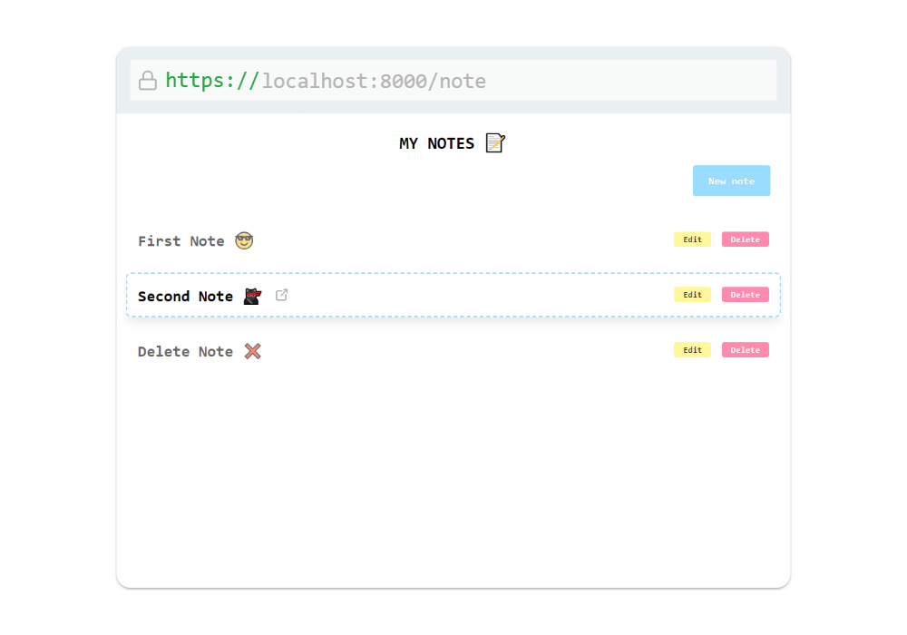
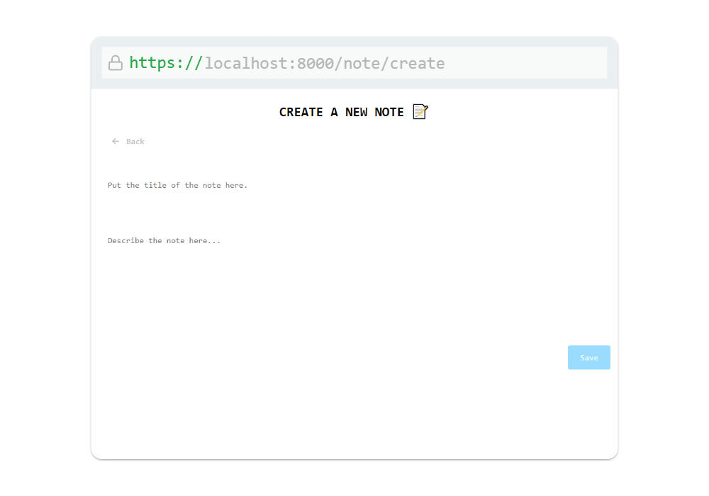

# Laravel Notes App

Este es un simple gestor de notas construido con Laravel. Permite crear, ver, editar y eliminar notas a través de una interfaz web.

## Capturas de pantalla

|  |  |  |
|---|---|---|
| Notes | Note | Create |

## Características

- Crear nuevas notas con un título y contenido.
- Ver una lista de todas las notas existentes.
- Editar notas existentes.
- Eliminar notas.

## Requisitos previos

- PHP >= 7.4
- Composer

## Instalación

1. Clona este repositorio en tu máquina local:

```bash
git clone https://github.com/lew5/laravel-notes-app
```

2. Instala las dependencias de PHP utilizando Composer:

```bash
composer install
```

3. Copia el archivo `.env.example` a `.env` y configura tu entorno:

```bash
cp .env.example .env
```

4. Genera una nueva clave de aplicación:

```bash
php artisan key:generate
```

5. Configura tu base de datos en el archivo `.env`:

```
DB_CONNECTION=mysql
DB_HOST=127.0.0.1
DB_PORT=3306
DB_DATABASE=nombre_de_tu_base_de_datos
DB_USERNAME=usuario_de_tu_base_de_datos
DB_PASSWORD=contraseña_de_tu_base_de_datos
```

6. Ejecuta las migraciones para crear las tablas de base de datos:

```bash
php artisan migrate
```

7. Inicia el servidor de desarrollo:

```bash
php artisan serve
```

## Uso

Accede a la aplicación en tu navegador visitando `http://localhost:8000/note`.

